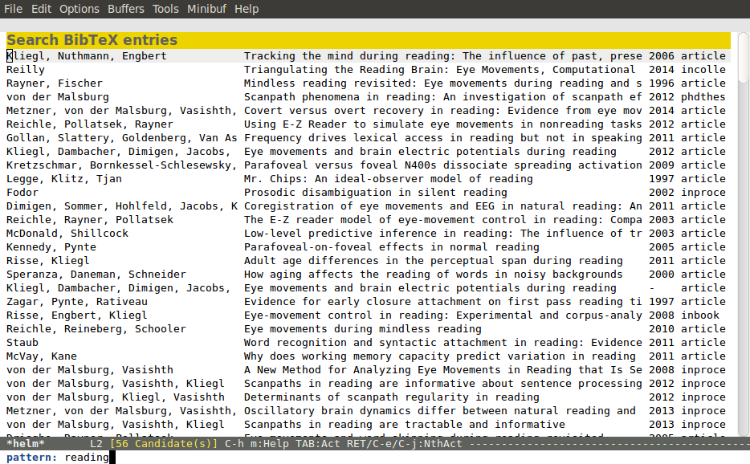

helm-bibtex
===========

A helm source for managing BibTeX bibliographies.

## News
- 05/14/2015: Added support for multiple PDF directories.
- 02/23/2015: Added a workaround for a bug in Emacs 24.3.1.  If you
  didn't see any publications, this should fix it.
- 02/11/2015:
   - Added resolution of cross-references.  Missing fields are imported from the cross-referenced entry (useful for conference abstracts).
   - Editors are shown when there are no authors (useful for conference proceedings).
   - Fields that should be ignored when exporting BibTeX can be configured via `helm-bibtex-no-export-fields` (useful to keep private notes private).
- 01/29/2015: Better formatting of plain text references following the APA style guide.
- 01/16/2015: The parsed bibliography is now cached which can dramatically improve responsiveness with larger bibliographies.

## Key features:

- Quick access to your bibliography from within Emacs
- Provides instant search results as you type
- Quick access to online bibliographic databases such as Pubmed,
  arXiv, Google Scholar, Library of Congress, etc.
- Support for multiple BibTeX files
- Open the PDF associated with an entry
- Open the URL or DOI of an entry in the browser
- Insert LaTeX cite command, ebib link, or pandoc citation depending on document type
- Insert BibTeX entry or plain text reference
- Add PDFs as attachments to emails
- Add notes to an entry
- Edit selected entry

## Description

Helm-bibtex allows the user to search for bibliographic entries in one or more bibtex-files.  In the default configuration, the user can search for the bibtex key, the entry type, the authors, the title, and the year.  Additional search fields can be configured if desired.  Various actions can be performed on the entries matching the search terms.  See the sections below for details.

Here is a screenshot showing a search for entries containing the word "eye tracking".

The regular expression "eye.?tracking" allows searching for different spellings ("eye tracking", "eye-tracking", "eyetracking").  A looped square symbol (⌘) next to an entry indicates that a PDF is available.  A pen symbol (✎) means that notes were added.  At the bottom, there are dummy entries that can be used to search online databases.  This list can be extended using the customization variable `helm-bibtex-fallback-options`.

## Requirements

In order to run helm-bibtex, a number of packages have to be installed on your system.  The easiest way to get these packages is through [MELPA](http://melpa.milkbox.net/#/).

- [Helm](http://melpa.milkbox.net/#/helm): incremental search framework (helm-bibtex is a plug-in for Helm)
- [parsebib](http://melpa.milkbox.net/#/parsebib): a parser for BibTeX files 
- [dash](http://melpa.milkbox.net/#/dash): a powerful list-processing library
- [s](http://melpa.milkbox.net/#/s): the long lost Emacs string manipulation library.
- [f](http://melpa.milkbox.net/#/f): a modern API for working with files and directories

## Installation

Helm-bibtex can be installed via [MELPA](http://melpa.milkbox.net/#/helm-bibtex).  Alternatively, put the file `helm-bibtex.el` in a directory included in your load-path.  Add the following line to your start-up file (typically init.el):

    (autoload 'helm-bibtex "helm-bibtex" "" t)

Tell helm-bibtex where your BibTeX file is by setting the customization variable `helm-bibtex-bibliography`.

    (setq helm-bibtex-bibliography "/path/to/bibtex-file.bib")

Alternatively, you can specify a list of BibTeX files.

    (setq helm-bibtex-bibliography '("/path/to/bibtex-file-1.bib" "/path/to/bibtex-file-2.bib"))

Other customization variables are:

- `helm-bibtex-library-path`: Location where PDFs of the entries are stored
- `helm-bibtex-pdf-symbol`: The symbol used to indicate that a PDF is present.  This should be one character (default: "⌘")
- `helm-bibtex-format-insert-citation-functions`: The functions used for formatting citations.  The publication can be cited, for example, as `\cite{key}` or `ebib:key` depending on the major mode of the current buffer.  Note that the functions should accept a list of keys as input.  With multiple marked entries one can insert multiple keys at once, e.g. `\cite{key1,key2}`.  See the functions `helm-bibtex-format-citation-ebib` and `helm-bibtex-format-citation-cite` as examples.  People who don't use Ebib (like myself) might prefer to use `helm-bibtex-format-citation-org-link-to-PDF` in org mode files, which inserts an org link to the PDF.
- `helm-bibtex-notes-path`: Location where notes are stored (one file per entry)
- `helm-bibtex-notes-extension`: File extension of the files containing the notes
- `helm-bibtex-notes-symbol`: The symbol used to indicate that notes were added.  This should be one character (default: "✎").
- `helm-bibtex-fallback-options`: Online databases for which dummy entries are provided
- `helm-bibtex-browser-function`: The browser that is used to access online databases
- `helm-bibtex-additional-search-fields`: Fields that are used for searching in addition to the default fields (author, title, year, entry-key, entry-type).  Can be used, for instance, to include keywords in searches: `(setq helm-bibtex-additional-search-fields '(keywords))`
- `helm-bibtex-pdf-open-function`: Function used for opening PDFs (the default function opens them in Emacs).

Helm-bibtex assumes that PDFs and notes have the BibTeX key of their associated entries as their base names plus ".pdf" for PDFs and whatever extension is configured for notes (".org" by default).

By default, helm-bibtex opens PDFs in Emacs (either with DocView or, if installed, with the much superior pdf-tools).  If you prefer to use the system's default viewer, you can set the customization variable `helm-bibtex-pdf-open-function` to `'helm-open-file-with-default-tool`.  To use a specific viewer (e.g., Skim on OSX), put something like the following in your initialization file:

    (setq helm-bibtex-pdf-open-function
      (lambda (fpath)
        (start-process "skim" "*skim*" "open" (concat "-a /Applications/Skim.app " fpath))))

## Usage

The command `helm-bibtex` starts a new search.  It is recommended to bind it to a convenient key for quick access.  For filtering, the following fields are used: author, title, year, and entry-type.  Regular expressions can be used as search terms.  Example searches:

Everything ever published by Janet Fodor:

    janet fodor

All PhD theses:

    phdthesis

Lyn Frazier's PhD thesis:

    phdthesis frazier

Publications about eyetracking (regular expression used to match various spellings: *eyetracking*, *eye tracking*, *eye-tracking*):

    eye.?tracking

Conference presentations in 2013:

    2013 inproceedings

Publications from 2010 and 2011:

    \(2010\|2011\)

Articles co-authored by David Caplan and Gloria Waters:

    article waters caplan

A common use case is where a search term is written in a document (say in your LaTeX manuscript) and you want to search for it in your bibliography.  In this situation, just start helm-bibtex and hit `M-n`.  This inserts the word under the cursor as the search term.  (This is a helm feature and can be used in all helm sources not just helm-bibtex.)  Note that it is also possible to use BibTeX keys for searching.  So if your cursor is on a BibTeX key (e.g., in a LaTeX cite command) you can start helm-bibtex, hit `M+n` and see the entry associated with that BibTeX key.

There are several actions for matching BibTeX entries:

- Open the PDF file associated with an entry if available (default).
- Open the URL or DOI associated with an entry in your web browser.
- Insert citation at point.
- Insert reference at point.
- Insert BibTeX key at point.
- Insert BibTeX entry at point.
- Add PDF as attachment to email.
- Edit notes associated with an entry.
- Show the entry in BibTeX file.

To execute an action, select an entry and press `TAB` to see the list of available actions.  The default action (open PDF) can be triggered by just pressing enter in the list of matching entries.

